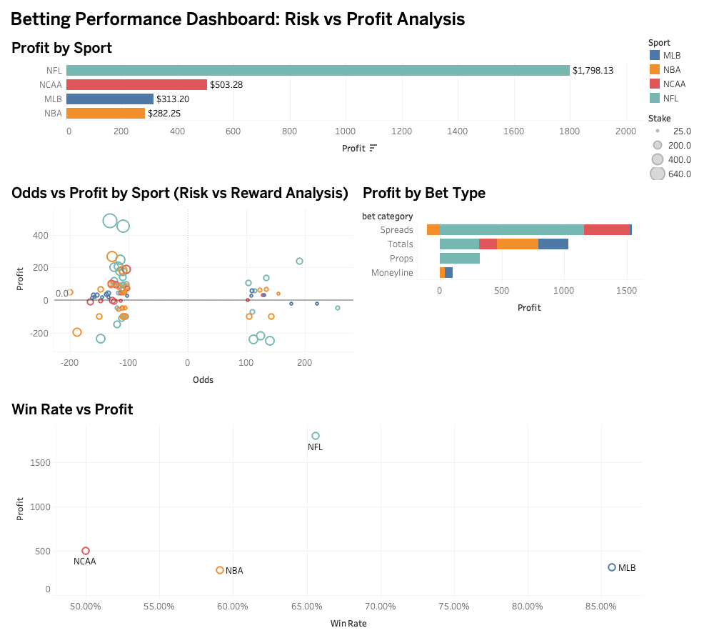

# sports-betting-analytics
SQL + Tableau project analyzing sports betting performance, profitability, and risk through an interactive dashboard

## Project Structure

- data/ → raw betting dataset  
- sql/ → SQL queries and table creation scripts  
- tableau/ → interactive dashboard file  
- images/ → dashboard and output visuals

- Betting frequency does not directly correlate with profitability, highlighting the importance of strategy over volume

- SQL + Tableau project analyzing sports betting performance, profitability, and risk through an interactive dashboard
